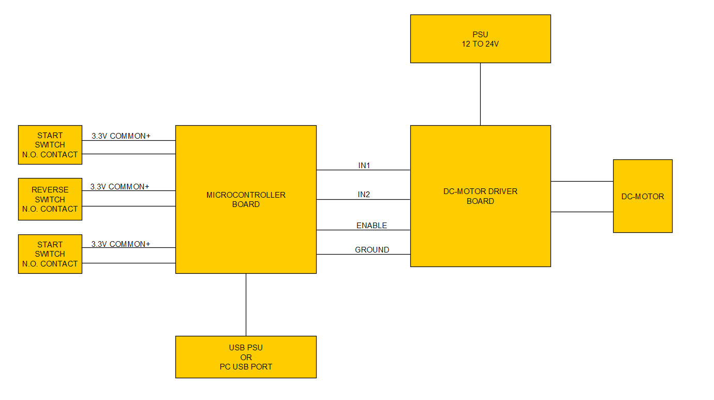
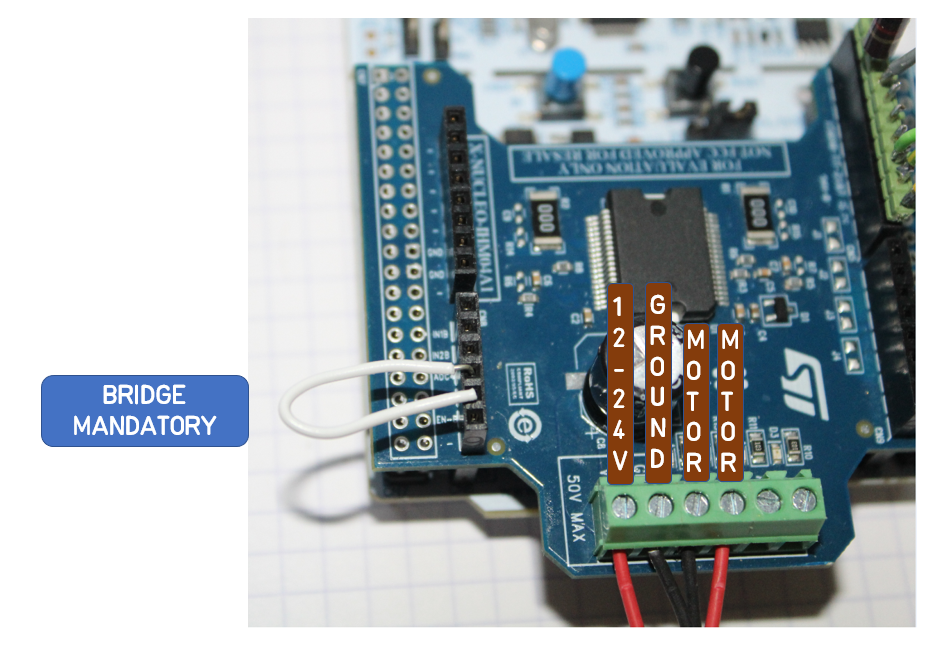

# FIRMWARE_14D_MotorTest

Nucleo F401 + [X-NUCLEO-IHM04A1](https://os.mbed.com/components/X-NUCLEO-IHM04A1/) version of [12D_MotorTest](https://github.com/nBlocksStudioApps/SCHEMATIC_12D_MotorTest)

This is a more compact H/W version due to smaller (Nucleo + X-Nucleo) PCBs. 
 
The nBlocksStudio Design is the same with [10D_MotorTest for mbed-LPC1768 + L298 ](https://github.com/nBlocksStudioApps/10D_MotorTest) and [12D_MotorTest for Nucleo-F401 + L298](https://github.com/nBlocksStudioApps/12D_MotorTest), only the paramaters that define the Pins to be used are different.

----

## nBlocksStudio Design
This is the Design of the [12D_MotorTest](https://github.com/nBlocksStudioApps/SCHEMATIC_12D_MotorTest) project. The I/O pins used in this project, are different and are modified in the main.cpp directly without using a Design Schematic.

----

<!-- pagebreak -->

## Block Diagram

----

<!-- pagebreak -->

## Switches connection

----

## Motor connection and bridge

----

<!-- pagebreak -->

## main.cpp

The lines with comment "X-NUCLEO" are updated directly in this file manually

----

